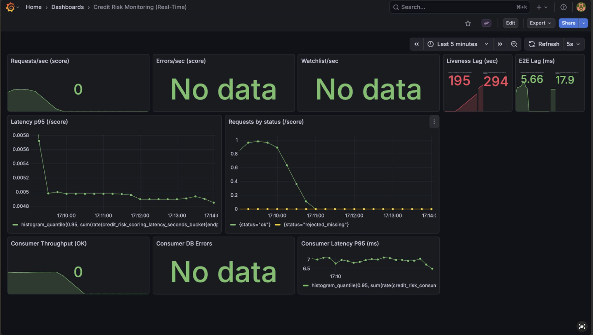
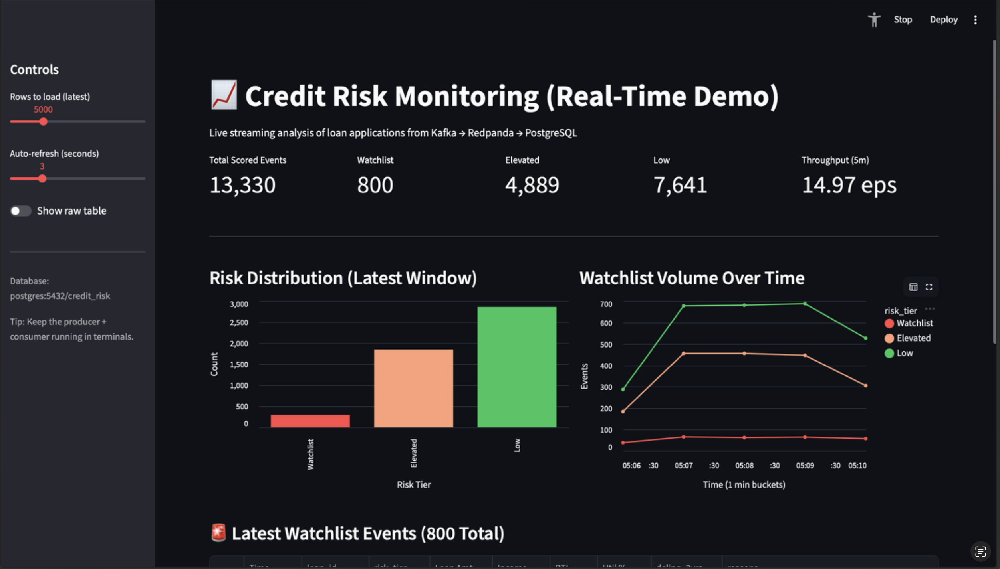

# Credit Risk Monitoring Dashboard

A stream processing system that monitors loan applications from Kafka, applies risk rules, and visualizes the results in real-time.

This project uses raw LendingClub data to build a pipeline for data cleaning, rule-based risk scoring, and system monitoring.

## 🚀 Main Features

*   **Data Ingestion**: Processes loan events using Redpanda (Kafka-compatible).
*   **Risk Scoring**: A Python consumer cleans data and flags high-risk applications based on debt-to-income (DTI) and utilization rules.
*   **Monitoring**: Uses Prometheus and Grafana to track system throughput and latency.
*   **Business Dashboard**: A Streamlit interface to see risk distributions and recent flagged events.
*   **Data Archiving**: Regularly uploads raw events and drift reports to AWS S3.

## 🏗️ Architecture


1.  **Ingestion**: Events flow through Redpanda.
2.  **Processing**: A Python worker scores events and saves them to PostgreSQL.
3.  **Storage**: Rule-based reports and raw backups are sent to S3.
4.  **Display**: Grafana (system health) and Streamlit (business data) pull from Prometheus and Postgres.

## 📈 ML & Analysis

This project includes a baseline Logistic Regression model (**AUC ≈ 0.69**) used primarily to benchmark the risk rules. It helps validate if our deterministic rules catch a similar population to a statistical model.

## 📊 Dashboards

### Engineering (Grafana)


### Business (Streamlit)


## ⚙️ How to Run

### 1. Prerequisites
*   Docker & Docker Desktop
*   Python 3.11+

### 2. Setup
```bash
cp .env.example .env
pip install -r requirements.txt
```

### 3. Start System
```bash
cd realtime/infra
docker compose up -d --build
```

### 4. Run Producer
```bash
export PYTHONPATH=$PYTHONPATH:$(pwd)/realtime
python realtime/streaming/producer.py --rate 10 --max 1000
```

## ️ Tech Stack
*   **Streaming**: Redpanda
*   **Database**: PostgreSQL & AWS S3
*   **Web**: FastAPI & Streamlit
*   **Observability**: Prometheus & Grafana
*   **Infrastructure**: Docker
