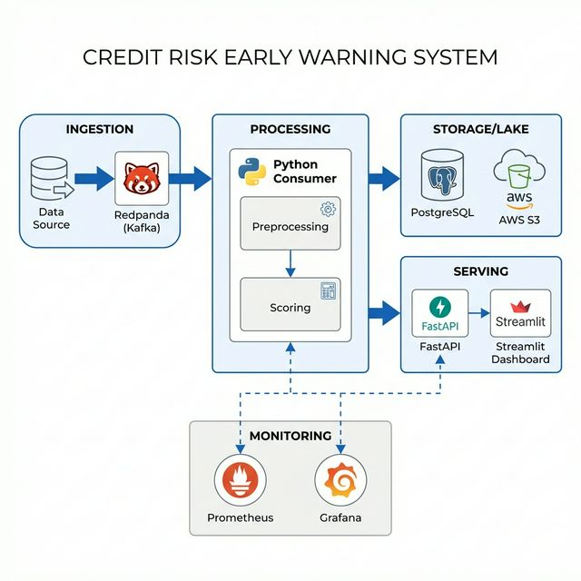

# Credit Risk Early Warning System

A production-grade, end-to-end credit risk monitoring ecosystem. This project transforms raw LendingClub loan data into a governed, real-time early-warning system—combining batch ML modeling with a high-performance streaming pipeline.

## 🚀 Key Capabilities

### 1. Real-Time Streaming & Observability (New)
*   **High-Throughput Ingestion**: Kafka-based (Redpanda) event stream processing.
*   **Real-Time Scoring API**: FastAPI-powered scoring engine with rule-based categorization.
*   **Full Observability**: Prometheus instrumentation for tracking consumer lag, throughput, and p95 latency.
*   **Grafana Dashboards**: Real-time engineering health monitoring and business analytics.
*   **Automated Data Lake**: Daily archival of raw events and drift reports to **AWS S3**.

### 2. Core Risk Modeling & Analytics
*   **Reproducible Preprocessing**: Standardized cleaning for rates, DTI, and credit history.
*   **Deterministic Risk Banding**: Auditable logic to flag high-risk borrowers.
*   **ML Lift Validation**: Logistic Regression model providing predictive lift (AUC = 0.69) over rule-based baselines.
*   **Drift Detection**: Automated data drift monitoring using Evidently to ensure model reliability.

---

## 🏗️ Technical Architecture



The system follows a modern "Medallion-style" architecture:
- **Silver Layer**: Scored events stored in **PostgreSQL** for real-time dashboarding.
- **Gold Layer**: Aggregated drift reports and raw event backups archived in **AWS S3**.

---

## 📊 Dashboards

### Real-Time Engineering Monitoring (Grafana)

*Track system health, consumer lag, and processing bottlenecks at a glance.*

### Business Risk Analytics (Streamlit)

*Visualize risk distributions, watchlist volume, and high-risk borrower profiles.*

---

## ⚙️ Quickstart

### Prerequisites
- Docker & Docker Desktop
- Python 3.11+
- AWS Account (for S3 Archival)

### Setup & Launch
1. **Clone the repo** and set up your environment:
   ```bash
   cp .env.example .env  # Add your AWS credentials and PG settings
   pip install -r requirements.txt
   ```

2. **Spin up the entire infrastructure**:
   ```bash
   cd realtime/infra
   docker compose up -d --build
   ```

3. **Stream live data**:
   ```bash
   # Run the producer to simulate real-time loan applications
   export PYTHONPATH=$PYTHONPATH:$(pwd)/realtime
   python realtime/streaming/producer.py --rate 10 --max 5000
   ```

### Access Points
- **Grafana**: [http://localhost:3000](http://localhost:3000) (admin/admin)
- **Business Dashboard**: [http://localhost:8501](http://localhost:8501)
- **Kafka Console**: [http://localhost:8080](http://localhost:8080)
- **Scoring API**: [http://localhost:8000/docs](http://localhost:8000/docs)

---

## 🛠️ Tech Stack
- **Languages**: Python (Pandas, Scikit-learn, FastAPI, Streamlit)
- **Streaming**: Redpanda (Kafka-compatible)
- **Database**: PostgreSQL
- **DevOps**: Docker, Prometheus, Grafana
- **Cloud**: AWS S3 (Storage), Evidently (Monitoring)

---

## 📂 Repository Structure
```text
├─ realtime/           # Real-time streaming services
│  ├─ app/api/         # Scoring API (FastAPI)
│  ├─ streaming/       # Kafka Consumer & Producer
│  ├─ dashboard/       # Streamlit Analytics
│  └─ infra/           # Docker Compose, Prometheus & Grafana configs
├─ monitoring/         # Drift detection & ML monitoring jobs
├─ scripts/            # Pre-processing & rule-generation scripts
├─ analysis/           # Offline ML modeling & ROC evaluations
├─ data/               # Local data samples (Git ignored)
└─ .env                # Secrets and S3 configuration
```
